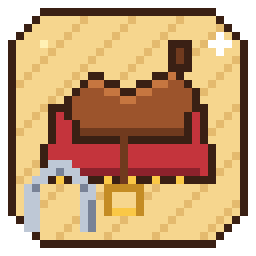

<p align="center"></p>

# Horse Tack & Styling

A Stardew Valley 1.6 SMAPI mod with a **stable wizard**: pick each horse's **coat**, **saddle**, **saddle pad**, **bridle** and **styling** separately, with a live animated preview. The layers are composited on each player's computer, and the choices are stored on the horse and **synced in multiplayer**, so everyone sees everyone's horse.

It ships its **own original art** (festival- and Stardew-themed coats, saddles, pads, bridles and styling, see [docs/ART-CATALOG.md](docs/ART-CATALOG.md)) and works as a **companion to [Elle's Cuter Horses](https://www.nexusmods.com/stardewvalley/mods/20042)**: if Elle's mod is installed, her 79 coats, prismatic hair and 24-colour saddles, pads and bridles show up in the wizard too, read straight from her mod folder at runtime. HorseTack never copies or redistributes her files, and everything works without her mod.

> **AI-generated disclosure:** the code, documentation, icon **and HorseTack's bundled art** (generated by the scripts in `tools/art` from recoloured vanilla sprite geometry) were made with the help of an AI coding assistant (Grok), directed and reviewed by MrGlim. Test it before relying on it.

## Requirements
- Stardew Valley 1.6+ and [SMAPI](https://smapi.io/) 4.0+ (built against 1.6.15 / SMAPI 4.5.2)
- No other mods are required.
- Recommended: [Elle's Cuter Horses](https://www.nexusmods.com/stardewvalley/mods/20042) (needs Content Patcher) for many more coats and tack colours. HorseTack's own art is drawn to fit both the vanilla and Elle's horse bodies.
- Optional: [Generic Mod Config Menu](https://www.nexusmods.com/stardewvalley/mods/5098)
- **Don't use together with Multiplayer Horse Reskin**: both replace horse textures and will fight (HorseTack logs a warning if it's installed). Remove `MultiplayerHorseReskin`.

## Install
1. Install SMAPI.
2. Unzip `HorseTack` into `Stardew Valley/Mods` (you get `Mods/HorseTack/manifest.json`).
3. Optional: install Elle's Cuter Horses, and/or drop your own 224x128 PNGs into `Mods/HorseTack/assets/...` (see below).
4. Run the game through SMAPI.

## Multiplayer
- **Every player needs HorseTack installed**, and should have **matching art packs**: the same HorseTack version (it ships the same built-in art) and, if anyone uses Elle's art, Elle's Cuter Horses too. The host must have HorseTack for anyone to make changes.
- Only the *choices* are synced (as short ids stored on the horse), never the pictures. If a player lacks a piece someone else picked (for example an Elle coat on a computer without Elle's Cuter Horses, or a PNG they didn't add), **that player** sees that layer skipped / the horse's normal coat, with no error (at most one trace-level line in the log). Everyone else still sees it.
- Farmhands can open the wizard any time; their change is sent to the host, which checks it and saves it on the horse, and the game syncs it to everyone. Nothing has to be set up by the host first.
- Works in split-screen too.

## Use
- **Stable spot:** stand in front of your stable and use the action button (right-click / gamepad A) on either **front corner post** of the stable (the bottom-left or bottom-right tile of the building, not the middle where the horse stands). The cursor turns into a hand there.
  - It never replaces mounting the horse, chests, or Tractor Mod's garage, and you don't need to hold anything.
- **Keybind (off by default):** set `OpenWizardKey` in `config.json` (e.g. `"OpenWizardKey": "H"`) or in Generic Mod Config Menu.
- **Console commands** (SMAPI window): `horsetack_open [horse]`, `horsetack_list`, `horsetack_options [layer]`, `horsetack_set <horse> <coat|saddle|pad|bridle|style> <id|none>`, `horsetack_reset <horse>`, `horsetack_reload`.

### Wizard
Every step shows the horse walking in all four directions with your current choices.
- Rows show the option name and a source tag (**HorseTack** or **Elle**).
- **Collection filter** above the list (*All*, then each collection that has art, e.g. *Spirit's Eve*, *Feast of the Winter Star*, *Elle: Appaloosa*, *Elle's Cuter Horses*): change it with Left/Right, D-pad left/right, or the arrows.
- **Quick scroll:** mouse wheel (3 rows per notch), PageUp/PageDown or gamepad bumpers jump a page.
- Mouse, keyboard (Up/Down, Enter, Backspace, Esc) and gamepad (A select, triggers Back/Next, B close) all work.

Steps:
0. **Horse**: only if you can restyle more than one horse
1. **Coat**: *Keep current* (whatever texture your horse has now) or a coat
2. **Saddle**, 3. **Saddle pad** (only with a saddle), 4. **Bridle**, 5. **Styling**: *None* or an option
6. **Confirm**: Apply

Steps with no art at all are skipped (Coat always stays, for *Keep current*).

### Permissions
- Only the horse's **owner** (the owner of its stable) or the **host** can restyle it. The host's `AnyoneCanEdit` lets everyone; the host's setting is shared with farmhands automatically.
- Choices live in the horse's `modData` (`MrGlim.HorseTack/coat`, `/style`, `/saddle`, `/pad`, `/bridle`), so they're saved with the farm.
- Each computer builds the composite texture itself right before the horse is drawn, so it updates as soon as a change syncs and survives warps, joining, mounting and day changes. Tractors (Tractor Mod) are never touched.
- Horses ridden by a farmhand can't be restyled until they dismount.

Layer order, bottom to top: coat, styling, saddle, pad, bridle.

## Art
- **HorseTack's own art** lives in `Mods/HorseTack/assets/{coats,saddles,pads,bridles,styles}`. Overlays come with an `Name@elle.png` fit variant that's used automatically when the horse underneath has an Elle-shaped body (an Elle coat, or *Keep current* while Elle's mod is installed).
- **Elle's Cuter Horses** art is read from her installed mod folder (her `assets/Horse` coats + prismatic overlay and `assets/Saddles` tack). Credit and all rights: Elle / Junimods.
- **Your own art:** drop 224x128 PNGs (the vanilla `Animals/horse` layout, 7x4 frames of 32x32) into the folders above; overlays must be transparent except for the tack. File names become option names (`LightBlue.png` -> "Light Blue"); a `Saddle_`/`Pad_`/`Bridle_` prefix is stripped and decides the layer; a prefix listed in `assets/collections.json` (e.g. `SpiritsEve_`) puts it in that collection. Wrong-size or non-PNG files are skipped with a warning; duplicates are shown once. Restart or run `horsetack_reload`. Only add art you made or may use. Details: [`assets/README.txt`](assets/README.txt).

## Config
| Setting | Default | |
|---|---|---|
| `OpenWizardKey` | *(empty = off)* | keybind to open the wizard anywhere |
| `AnyoneCanEdit` | `false` | let every player restyle every horse (host's setting counts) |
| `StableActionTiles` | `true` | add the wizard to the stable's front posts |
| `LogVerbosity` | `Normal` | `Verbose` logs extra details to the console |

## Compatibility / notes
- *Keep current* is whatever texture the game gives the horse, so horse retextures (including Elle's selected coat) keep working underneath.
- The vanilla sheet has a small built-in saddle; HorseTack's own coats paint it out, and saddle overlays cover it.
- **Multiplayer Horse Reskin** conflicts (both replace the horse texture); remove it. Alternative Textures skins on horses may also conflict; use one or the other for a given horse.
- Elle's saddles/pads/bridles are drawn for her body shape and may sit slightly off on HorseTack's vanilla-shaped coats.

## Building
```
dotnet build -c Release                      # uses the Steam install
dotnet build -c Release -p:GamePath=../refs  # or a folder with copied game/SMAPI DLLs (never commit them)
```
Output: `bin/Release/` (`HorseTack.dll`, `manifest.json`, `i18n/`, `assets/`). Checks and art:
```
dotnet run --project tests/AssetScanCheck -p:GamePath=../refs   # scanning, @elle variants, collections, Elle folder, multiplayer id rules
python tests/CompositingCheck/check_compositing.py <folder of 224x128 PNGs> [vanilla_horse.png]
python tools/art/generate_art.py <vanilla horse.png>            # regenerate HorseTack's art (see tools/art)
```

## Credits
- **Elle / Junimods** for [Elle's Cuter Horses](https://www.nexusmods.com/stardewvalley/mods/20042), which HorseTack can read at runtime (never bundled).
- Idea inspired by **DelphinWave**'s [Multiplayer Horse Reskin](https://github.com/DelphinWave/MultiplayerHorseReskin) (MIT). No code from it is used.
- Built on [SMAPI](https://smapi.io/) by Pathoschild. Horse geometry follows ConcernedApe's vanilla horse sprite layout.

## License
[MIT](LICENSE) © 2026 MrGlim (Ben Hough). Covers this repository's code, docs and HorseTack's own generated art; not game assets, Elle's art, or art you add yourself.

## Changelog
- **1.2.0**: companion mode + original art. Ships 27 original pieces (5 coats, 6 saddles, 7 pads, 4 bridles, 5 styling overlays) with Elle-body fit variants and collection names; reads Elle's Cuter Horses at runtime again when installed (optional dependency). Wizard: collection filter, page jump / quick scroll, source tags, empty steps skipped. Multiplayer: farmhands can pick art the host doesn't have (each computer draws what it has; missing pieces fall back silently), host's `AnyoneCanEdit` is shared with farmhands. Warns if Multiplayer Horse Reskin is installed.
- **1.1.0**: self-contained. Art came only from the mod's own `assets` folder (case-insensitive, validated 224x128, de-duplicated). With empty folders the wizard still opens.
- **1.0.0**: first build (stable wizard, multiplayer sync, compositor).
